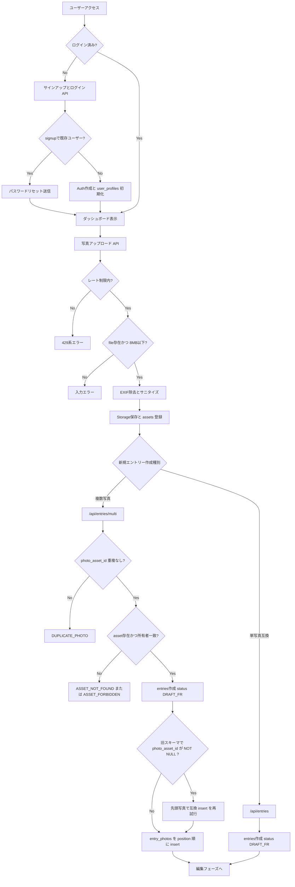
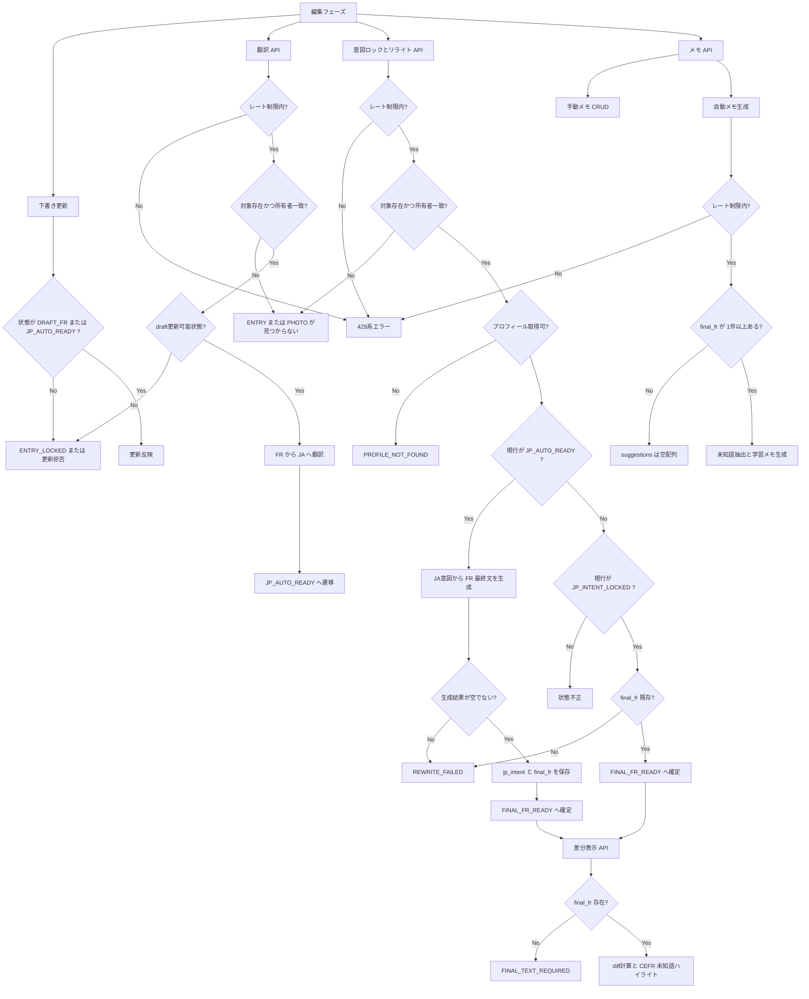
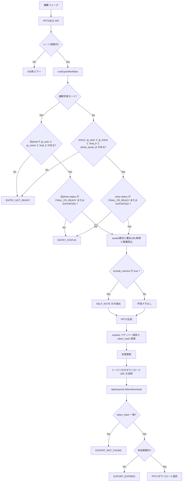
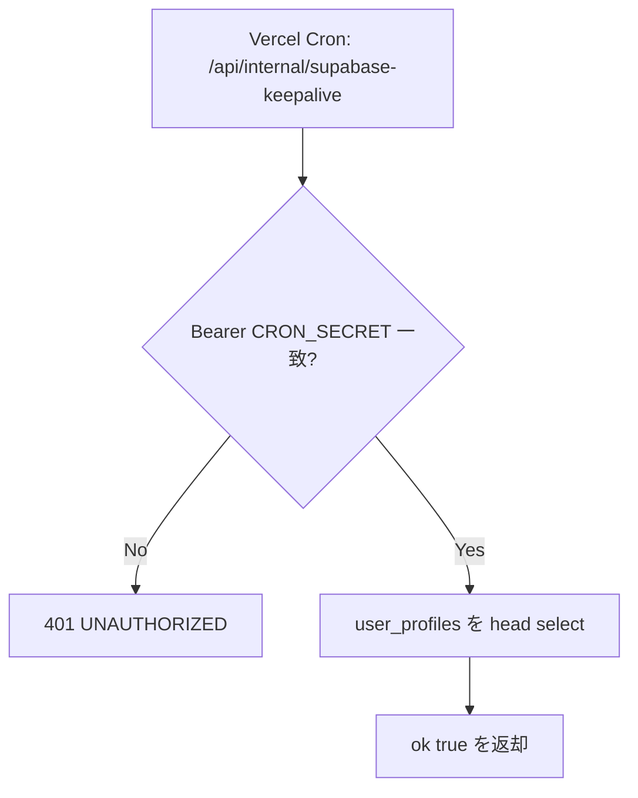

# PHOTO-TEXTE

PHOTO-TEXTE 作成アプリです（Next.js + Supabase + OpenAI API）。

## 概要

- **目的**: 写真ごとのフランス語下書きから、日本語意図整理→最終フランス語化→PPTX出力までを一貫処理。
- **主な構成**: Next.js (App Router) / Supabase (Auth, Postgres, Storage) / OpenAI API（未設定時はフォールバック文生成）。
- **データモデルの要点**:
  - 現行: `entries` + `entry_photos`（複数写真）
  - 互換: `entries` 単体（旧・単写真フロー）

---

## システム全体フロー（精密版）

### 1. 認証からエントリー作成まで



### 2. 編集と最終文確定



### 3. エクスポートとダウンロード



### 4. 定期 keepalive



---

## ステータスマシン（業務状態）

- 共通状態: `DRAFT_FR → JP_AUTO_READY → JP_INTENT_LOCKED → FINAL_FR_READY → EXPORTED`
- 下書き編集可: `DRAFT_FR`, `JP_AUTO_READY` のみ
- リライト可: `JP_INTENT_LOCKED` のみ（`/rewrite` ワークフロー）
- エクスポート可:
  - 複数写真: すべての写真が `FINAL_FR_READY` または `EXPORTED`
  - 単写真: entry が `FINAL_FR_READY` または `EXPORTED`

---

## 最小セットアップ

### 1) 環境変数

`.env.local` を作成し設定:

```env
NEXT_PUBLIC_SUPABASE_URL=
NEXT_PUBLIC_SUPABASE_ANON_KEY=
SUPABASE_SERVICE_ROLE_KEY=
CRON_SECRET=
APP_MASTER_KEY_B64=
OPENAI_API_KEY=
OPENAI_MODEL=gpt-4o-mini
PHOTO_BUCKET=photos
EXPORT_BUCKET=exports
```

`APP_MASTER_KEY_B64` 生成:

```bash
openssl rand -base64 32
```

### 2) Supabase

- プロジェクト作成
- SQL Editor でマイグレーション適用: `supabase/migrations/202602050001_init_photo_texte.sql`

### 3) 起動

```bash
npm install
npm run dev
```

### 4) テスト

```bash
npm test
```

---

## デプロイ要点（Vercel）

- GitHub連携で `Next.js` として Import
- 上記環境変数を Vercel Project に登録
- Supabase `Authentication > URL Configuration` に本番URLを設定
- `vercel.json` の Cron で毎日 keepalive 実行（`CRON_SECRET` 必須）
